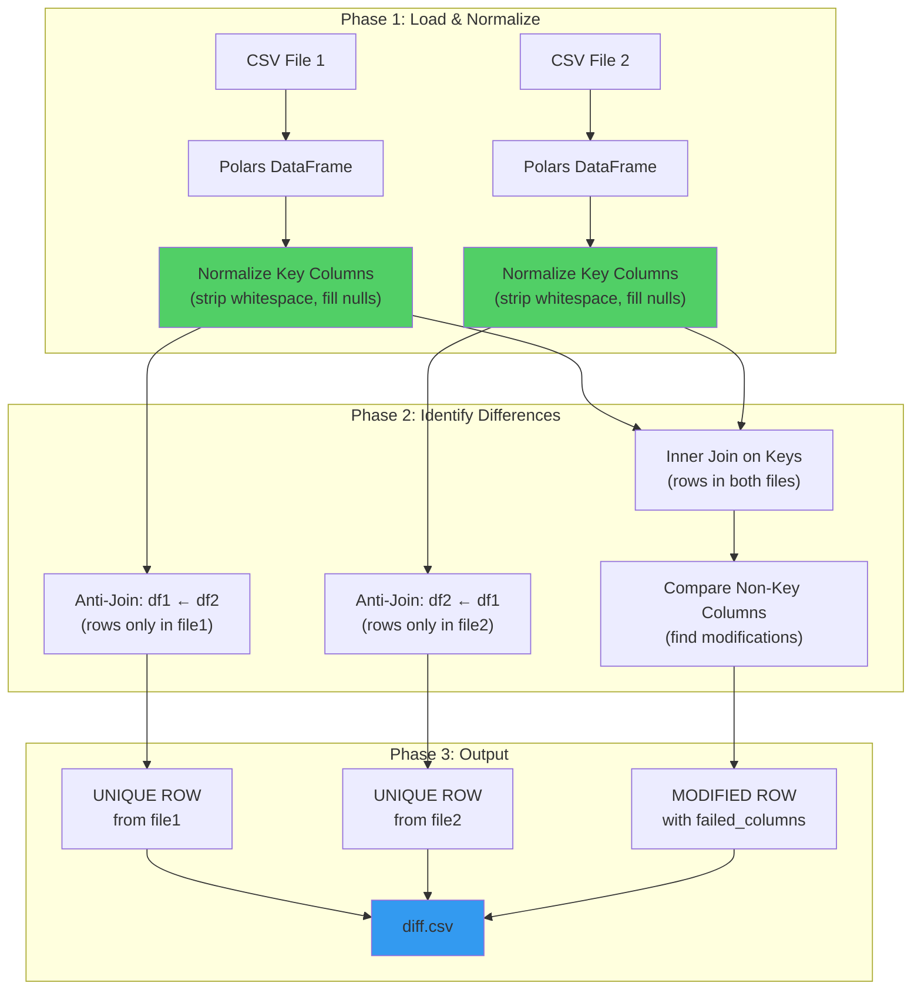
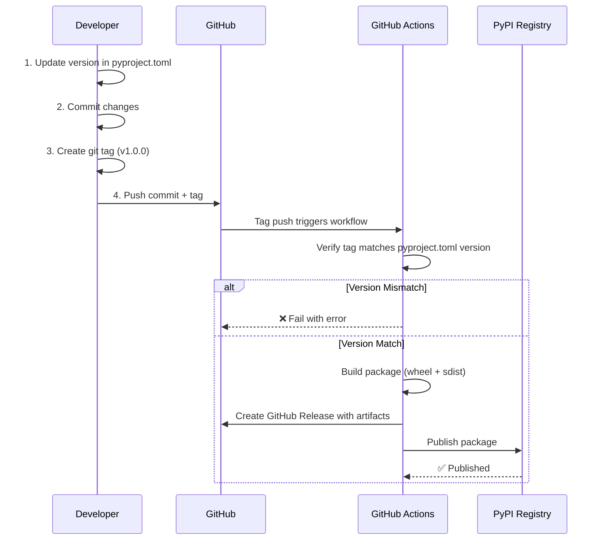
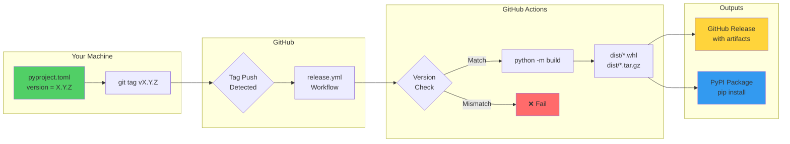
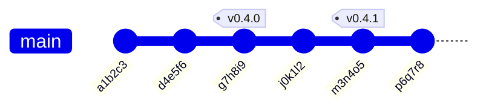
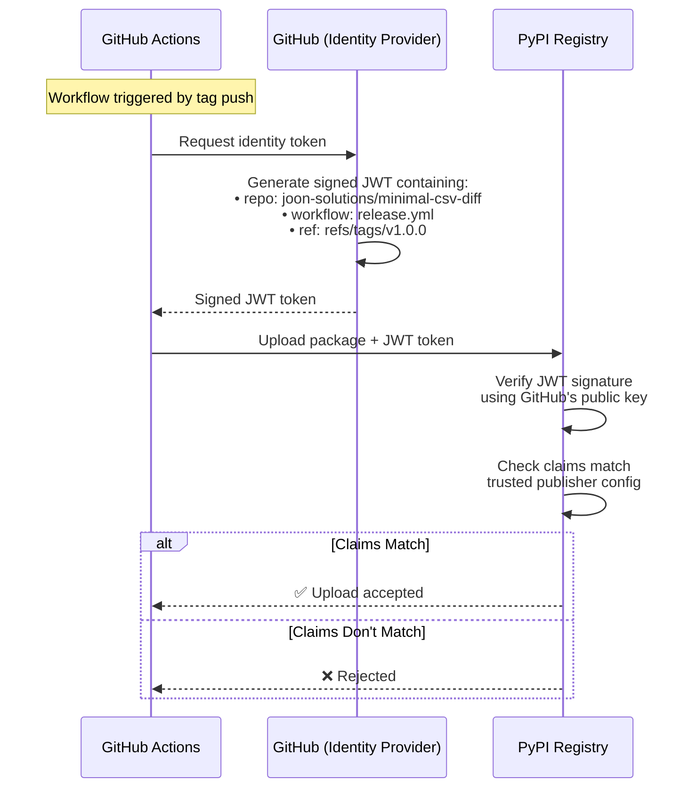
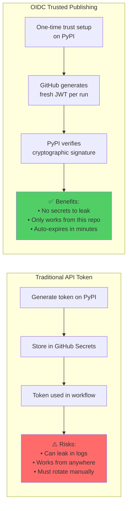

[](https://github.com/joon-solutions/minimal-csv-diff/actions/workflows/CI.yml)

# 📊 minimal-csv-diff

A high-performance tool to compare CSV files and generate diff reports for data validation. Built with **Polars** for 10-100x faster comparisons on large datasets.

## ✨ Features

- 🔍 Compare two CSV files with composite key matching
- ⚡ **Blazing fast** — handles 800k+ rows in seconds (Polars-powered)
- 🎯 Interactive mode or CLI with explicit keys
- 📋 Detailed diff reports showing unique rows and column-level changes
- 🤖 **LLM-agent friendly API** for programmatic access
- 📁 Exports results to CSV format for further analysis

## 🚀 Quick Start

### Option 1: Run Instantly (No Installation) ⭐

```bash
uvx minimal-csv-diff
```

### Option 2: Install & Run

```bash
pip install minimal-csv-diff
minimal-csv-diff
```

### Option 3: CLI with Explicit Keys

```bash
minimal-csv-diff file1.csv file2.csv --key="id,date,name" --output=diff.csv
```

## 🎮 Try the Demo

Want to see it in action? Check out the [demo](demo/demo.md) directory:

```bash
cd demo/
minimal-csv-diff
# Follow prompts: select files 0,1 and choose a key column
# See the magic happen! ✨
```

The demo includes sample CSV files and shows how the tool identifies:
- 🔴 **Unique rows** (exist in only one file)
- 🟡 **Column differences** (same record, different values)
- ✅ **Matching records** (excluded from output)

## 🧠 How It Works

The diff engine uses a **three-phase comparison** strategy:



### Key Matching Logic

| Scenario | Result |
|----------|--------|
| Key exists in file1 only | `UNIQUE ROW` (source: file1) |
| Key exists in file2 only | `UNIQUE ROW` (source: file2) |
| Key exists in both, values identical | No output (match) |
| Key exists in both, values differ | Two rows showing old → new values |

## 📤 Output Format

When differences are found, generates a `diff.csv` with:

| Column | Description |
|--------|-------------|
| `surrogate_key` | Concatenated key fields (e.g., `acme\|sales\|orders`) |
| `source` | Which file the row comes from |
| `failed_columns` | `UNIQUE ROW` or list of changed columns |
| *...all columns* | Complete row data for comparison |

**Example output:**

```csv
"source","failed_columns","surrogate_key","id","name","value"
"old.csv","value","1|Alice","1","Alice","100"
"new.csv","value","1|Alice","1","Alice","150"
"old.csv","UNIQUE ROW","2|Bob","2","Bob","200"
```

## 🤖 Programmatic API (LLM-Agent Friendly)

```python
from minimal_csv_diff import compare_csv_files, quick_csv_diff

# Option 1: Explicit keys
result = compare_csv_files(
    'old.csv', 'new.csv',
    key_columns=['id', 'date'],
    output_file='diff.csv'
)

# Option 2: Auto-detect keys
result = quick_csv_diff('old.csv', 'new.csv')

# Check results
if result['differences_found']:
    print(f"Found {result['summary']['total_differences']} differences")
    print(f"Output: {result['output_file']}")
```

**Return structure:**
```python
{
    'status': 'success' | 'no_differences' | 'error',
    'differences_found': bool,
    'output_file': str | None,
    'summary': {
        'total_differences': int,
        'unique_rows': int,
        'modified_rows': int,
        'common_columns': int,
        'key_columns_used': list
    },
    'error_message': str | None
}
```

## 💡 Use Cases

- **🔄 Data validation** between different data sources
- **🔧 ETL pipeline testing** — compare before/after transformations
- **🗄️ Database migration verification** — ensure data integrity
- **📊 Looker/BI validation** — compare query results across environments
- **🧪 A/B testing** — identify differences in experimental datasets
- **🤖 LLM workflows** — automated data quality checks

## ⚡ Performance

Built on [Polars](https://pola.rs/) for maximum performance:

| Dataset Size | Time |
|--------------|------|
| 10k rows | < 1 second |
| 100k rows | ~2 seconds |
| 800k rows | ~20 seconds |

All string normalization runs as native Rust SIMD operations — no Python UDF overhead.

## 🛠️ Development

This project uses [uv](https://github.com/astral-sh/uv) for dependency management.

```bash
git clone https://github.com/joon-solutions/minimal-csv-diff
cd minimal-csv-diff
uv sync
uv run pytest tests/ -v
uv run minimal-csv-diff
```

## 📋 Requirements

- Python >= 3.10
- polars >= 0.20.0

---

## 📦 Publishing a New Release

This project uses a **tag-triggered CI/CD workflow** for publishing to PyPI. This approach is simple, explicit, and foolproof.

### How It Works



### Release Steps

```bash
# 1. Update version in pyproject.toml
#    Change: version = "0.4.1" → version = "0.5.0"

# 2. Commit the version bump
git add pyproject.toml
git commit -m "chore: release v0.5.0"

# 3. Create a git tag matching the version
git tag v0.5.0

# 4. Push both commit and tag
git push && git push --tags
```

That's it! The workflow automatically:
- ✅ Verifies the tag version matches `pyproject.toml`
- ✅ Builds the package (wheel + source distribution)
- ✅ Creates a GitHub Release with auto-generated notes
- ✅ Publishes to PyPI

### Architecture Overview



### Understanding Git Tags

> **For Maintainers:** Tags are NOT branches. They're immutable pointers to specific commits — think "bookmarks" for releases.



| Concept | Branch | Tag |
|---------|--------|-----|
| **What it is** | Moving pointer that advances with commits | Fixed pointer to one specific commit |
| **Purpose** | Track ongoing work | Mark releases/milestones |
| **Changes?** | Moves forward as you commit | Never moves (immutable) |

**Why `git push --tags` is separate:** Tags live in a separate namespace from branches. This is intentional — you might create local tags for testing that you don't want to push. Pushing tags should be deliberate since they trigger releases.

```bash
git push              # Pushes commits only
git push --tags       # Pushes tags only
git push && git push --tags  # Push both
```

### PyPI Trusted Publishing (OIDC)

This repository uses **OpenID Connect (OIDC) Trusted Publishing** — a secure, credential-free way to publish to PyPI. No API tokens are stored in GitHub secrets.

#### Current Configuration

| Setting | Value |
|---------|-------|
| **Repository** | `joon-solutions/minimal-csv-diff` |
| **Workflow** | `release.yml` |
| **Environment** | (Any) |

#### How OIDC Authentication Works

Unlike traditional API tokens (which can leak or expire), OIDC uses **cryptographic identity verification**:



#### Why This Is Secure

The JWT token GitHub generates contains verifiable **claims**:

```json
{
  "repository": "joon-solutions/minimal-csv-diff",
  "workflow": "release.yml", 
  "ref": "refs/tags/v1.0.0",
  "iss": "https://token.actions.githubusercontent.com",
  "exp": 1709914200
}
```

PyPI verifies:
1. **Signature** — Cryptographically signed by GitHub's private key (impossible to forge)
2. **Repository** — Must match `joon-solutions/minimal-csv-diff`
3. **Workflow** — Must be `release.yml`
4. **Expiration** — Token valid for ~15 minutes only



#### Setup (Already Done)

For new projects, you'd configure this on PyPI:

1. Go to [pypi.org](https://pypi.org) → Your Project → Settings → Publishing
2. Add a new "Trusted Publisher":
   - **Owner**: `joon-solutions`
   - **Repository**: `minimal-csv-diff`
   - **Workflow name**: `release.yml`
   - **Environment**: *(leave blank)*
3. Save

### Troubleshooting

| Issue | Cause | Fix |
|-------|-------|-----|
| "Tag version doesn't match" | pyproject.toml version ≠ git tag | Ensure `v1.2.3` tag matches `version = "1.2.3"` |
| "Trusted publishing failed" | PyPI not configured | Add trusted publisher on PyPI (see above) |
| Workflow didn't trigger | Tag not pushed | Run `git push --tags` |
| "Version already exists" | Re-releasing same version | Bump version number, create new tag |

### Why Tag-Triggered Releases?

| Approach | Pros | Cons |
|----------|------|------|
| **Tag-triggered** ✅ | Explicit control, simple debugging, works locally | Manual version bump |
| Semantic-release | Auto-versioning from commits | Fragile, commit message format matters, hard to debug |
| Push to main | Fully automated | Publishes every commit, version conflicts |

We chose tag-triggered because **you decide when to release**, and the workflow is transparent and debuggable