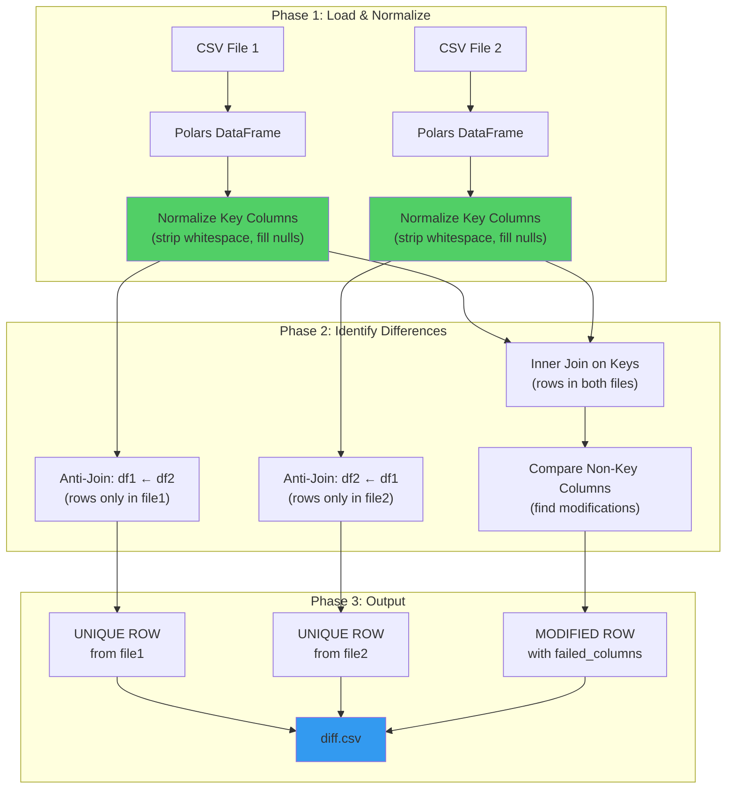

[](https://github.com/joon-solutions/minimal-csv-diff/actions/workflows/CI.yml)

# 📊 minimal-csv-diff

A high-performance tool to compare CSV files and generate diff reports for data validation. Built with **Polars** for 10-100x faster comparisons on large datasets.

## ✨ Features

- 🔍 Compare two CSV files with composite key matching
- ⚡ **Blazing fast** — handles 800k+ rows in seconds (Polars-powered)
- 🎯 Interactive mode or CLI with explicit keys
- 📋 Detailed diff reports showing unique rows and column-level changes
- 🤖 **LLM-agent friendly API** for programmatic access
- 📁 Exports results to CSV format for further analysis

## 🚀 Quick Start

### Option 1: Run Instantly (No Installation) ⭐

```bash
uvx minimal-csv-diff
```

### Option 2: Install & Run

```bash
pip install minimal-csv-diff
minimal-csv-diff
```

### Option 3: CLI with Explicit Keys

```bash
minimal-csv-diff file1.csv file2.csv --key="id,date,name" --output=diff.csv
```

## 🎮 Try the Demo

Want to see it in action? Check out the [demo](demo/demo.md) directory:

```bash
cd demo/
minimal-csv-diff
# Follow prompts: select files 0,1 and choose a key column
# See the magic happen! ✨
```

The demo includes sample CSV files and shows how the tool identifies:
- 🔴 **Unique rows** (exist in only one file)
- 🟡 **Column differences** (same record, different values)
- ✅ **Matching records** (excluded from output)

## 🧠 How It Works

The diff engine uses a **three-phase comparison** strategy:



### Key Matching Logic

| Scenario | Result |
|----------|--------|
| Key exists in file1 only | `UNIQUE ROW` (source: file1) |
| Key exists in file2 only | `UNIQUE ROW` (source: file2) |
| Key exists in both, values identical | No output (match) |
| Key exists in both, values differ | Two rows showing old → new values |

## 📤 Output Format

When differences are found, generates a `diff.csv` with:

| Column | Description |
|--------|-------------|
| `surrogate_key` | Concatenated key fields (e.g., `acme\|sales\|orders`) |
| `source` | Which file the row comes from |
| `failed_columns` | `UNIQUE ROW` or list of changed columns |
| *...all columns* | Complete row data for comparison |

**Example output:**

```csv
"source","failed_columns","surrogate_key","id","name","value"
"old.csv","value","1|Alice","1","Alice","100"
"new.csv","value","1|Alice","1","Alice","150"
"old.csv","UNIQUE ROW","2|Bob","2","Bob","200"
```

## 🤖 Programmatic API (LLM-Agent Friendly)

```python
from minimal_csv_diff import compare_csv_files, quick_csv_diff

# Option 1: Explicit keys
result = compare_csv_files(
    'old.csv', 'new.csv',
    key_columns=['id', 'date'],
    output_file='diff.csv'
)

# Option 2: Auto-detect keys
result = quick_csv_diff('old.csv', 'new.csv')

# Check results
if result['differences_found']:
    print(f"Found {result['summary']['total_differences']} differences")
    print(f"Output: {result['output_file']}")
```

**Return structure:**
```python
{
    'status': 'success' | 'no_differences' | 'error',
    'differences_found': bool,
    'output_file': str | None,
    'summary': {
        'total_differences': int,
        'unique_rows': int,
        'modified_rows': int,
        'common_columns': int,
        'key_columns_used': list
    },
    'error_message': str | None
}
```

## 💡 Use Cases

- **🔄 Data validation** between different data sources
- **🔧 ETL pipeline testing** — compare before/after transformations
- **🗄️ Database migration verification** — ensure data integrity
- **📊 Looker/BI validation** — compare query results across environments
- **🧪 A/B testing** — identify differences in experimental datasets
- **🤖 LLM workflows** — automated data quality checks

## ⚡ Performance

Built on [Polars](https://pola.rs/) for maximum performance:

| Dataset Size | Time |
|--------------|------|
| 10k rows | < 1 second |
| 100k rows | ~2 seconds |
| 800k rows | ~20 seconds |

All string normalization runs as native Rust SIMD operations — no Python UDF overhead.

## 🛠️ Development

This project uses [uv](https://github.com/astral-sh/uv) for dependency management.

```bash
git clone https://github.com/joon-solutions/minimal-csv-diff
cd minimal-csv-diff
uv sync
uv run pytest tests/ -v
uv run minimal-csv-diff
```

## 📋 Requirements

- Python >= 3.10
- polars >= 0.20.0